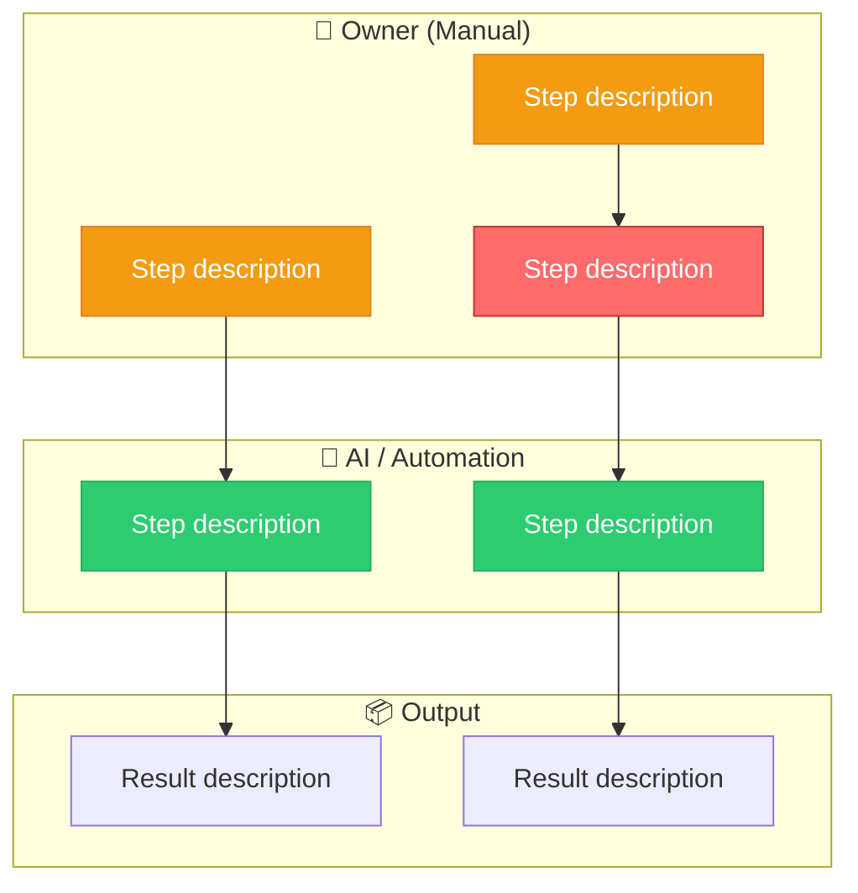
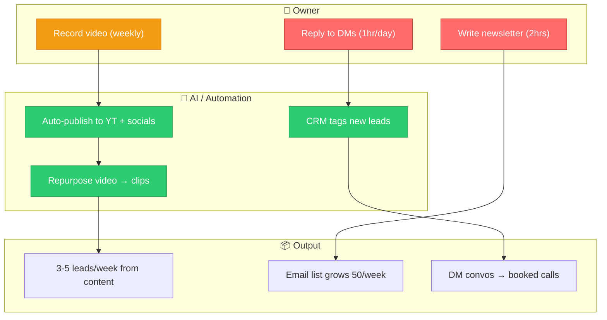

# Swim Lane Mermaid Template

Use this template when mapping a core system (Lead Gen, Sales, or Fulfillment) in Phase 2.

## Template

## Class Guide

| Class | Meaning | When to use |
|-------|---------|-------------|
| `:::bottleneck` | Human doing repetitive work AI could handle | The core finding — this is what gets automated |
| `:::automated` | Already handled by a system or tool | Show what's working to give credit |
| `:::manual` | Human step that's appropriate (judgment, relationship) | Not everything needs automating |

## Example: Lead Gen System

In this example, `O2` and `O3` are bottlenecks — the owner spends 3+ hours/day on tasks that could be AI-assisted (newsletter drafting, DM triage).
